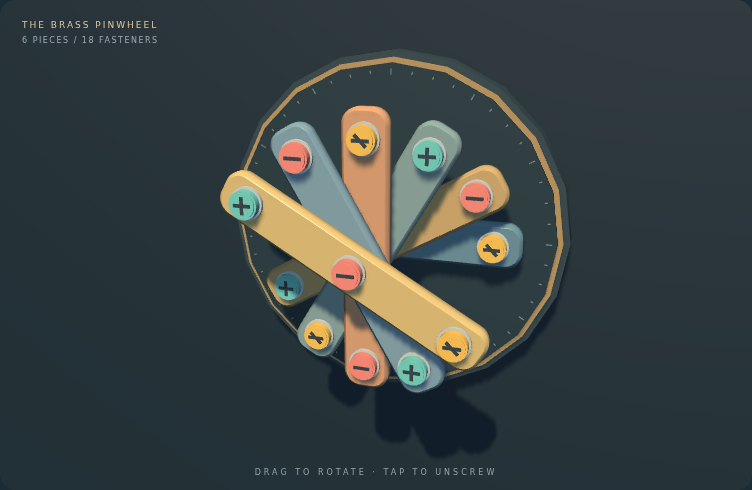

# Screw Loose

An ad-free, browser-first screw-sorting puzzle inspired by the genre of Screwdom. Original procedural visuals, with no copied assets, ads, accounts, timers, paid boosts, or energy system.



## Run the demo

Requires Node.js 24+ and npm.

```sh
npm ci
npm run dev
```

Open the localhost URL printed by Vite. No PlayCanvas Editor account is required.

## Play

Tap an exposed colored screw. It goes into a matching tray, or into one of five spare slots. Three matching screws complete a tray and bring in the next tray; parked screws automatically transfer when their color becomes available. Empty pieces tilt and fall away to expose the layer below. Clear all 18 screws to win. Filling all five spare slots ends the attempt. Undo and restart are unlimited and free.

The Brass Pinwheel is a hand-authored, solver-tested 3D level: six overlapping beveled metal beams, threaded fasteners, mounting seats, and a dial-like turntable. Drag the model to orbit the perspective camera; **Reset view** restores the initial angle. Rotation is limited to useful front-side viewing angles. Some screws require a different view to see clearly; rotation never changes the underlying access rules.

Screws spin and lift out before flying toward the tray or spare-slot area. Released beams tilt and fall off the assembly. These are deterministic visual animations, not a rigid-body physics simulation. Input pauses briefly during removal; **undo and restart remain available and cancel animations immediately**. Reduced-motion settings skip the animations. The renderer draws only when the camera, scene, or animation changes.

The expandable keyboard controls offer labeled buttons for every exposed screw, and remain playable if WebGL initialization fails. Every fastener has the same Phillips cross recess; color is reserved for tray matching. Sound, progression, saving, fuller accessibility, and tray-to-tray transfer choreography remain follow-up work.

## Development

```sh
npm test                 # engine-independent rules and solvability tests
npm run build           # strict TypeScript checking and production bundle
npx playwright install chromium
npm run test:browser    # desktop/mobile input, animations, full playthrough and reduced-motion tests
npm run preview         # serve the production build locally
```

`dist/` is a static site and can be hosted by any static host. No hosting deployment is included in this scaffold. Vite's default root base assumes hosting at `/`; run `npx vite build --base=/screw_loose/` after type checking for GitHub Pages subpath hosting.

## Structure

- `src/game.ts`: level data, pure state transitions, exposure rules, tray routing, win/loss detection. No PlayCanvas or DOM dependency.
- `src/scene.ts`: PlayCanvas scene, perspective orbit camera, ray picking with plate occlusion, lighting/shadows, and cancellable animation.
- `src/geometry.ts`: beveled, rounded plate mesh generation.
- `src/main.ts`: UI/state coordination and undo snapshots.
- `src/style.css`: responsive workshop UI.
- `tests/`: rules/solvability tests and Playwright browser smoke tests.
- `.github/workflows/ci.yml`: tests, type checking, production build and Chromium smoke tests.

Keep level definitions and rules independent of presentation. Animations visualize committed moves without changing deterministic puzzle outcomes. Plate transforms are shared between exposure checks and the renderer; do not infer gameplay access from camera visibility. Do not add advertising, paid retries, or artificial wait timers.

## Roadmap

See GitHub issues for level validation and authoring, an expanded campaign, animation, accessibility and mobile polish, local saves, audio, and release hosting/offline support.

Engine setup reference: https://developer.playcanvas.com/user-manual/engine/standalone/
